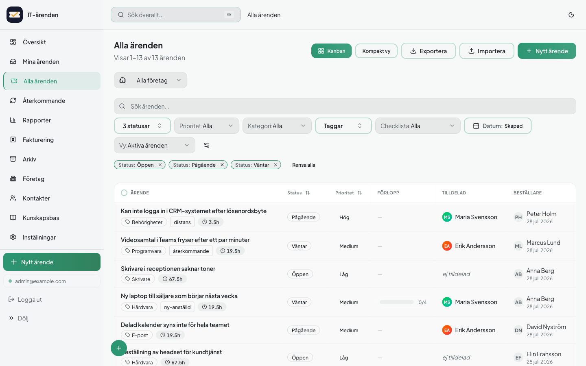
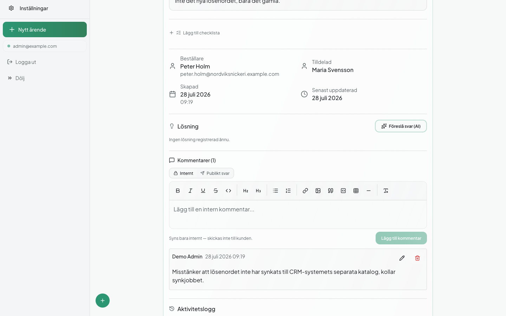

<!-- Decorative: the heading immediately below already carries the product name. -->


# IT-Ticket

**A self-hosted helpdesk for the technician doing the work, not the manager tracking it — ticket to invoice in one system, with no per-agent license fee.**

[](https://github.com/Antonk123/it-system/actions/workflows/ci.yml)
[](LICENSE)
[](.nvmrc)



> **Read this first:** the application UI is currently **Swedish only**. There is no i18n layer —
> interface strings are hardcoded and `index.html` ships `lang="sv"`. The code, API and
> documentation are English. If you need an English UI today, this is not ready for you yet;
> translating it is the most valuable contribution available right now.

---

## Why this instead of Jira / Freshdesk / Zendesk

If you are a one-person IT shop or a small MSP, those tools charge per agent per month, forever,
for a workflow built around software project management or enterprise support tiers you will
never use. The concrete differences:

- **No per-user pricing.** MIT-licensed and self-hosted. Add ten technicians tomorrow and your
  bill does not change, because there is no bill.
- **Your data stays on your infrastructure.** A SQLite file on your disk, your backups, your
  retention policy. Nothing leaves the server unless you configure it to — SMTP, IMAP, outbound
  webhooks, web push, or the optional Anthropic API for the AI features.
- **Ticket → invoice in the same system.** Time logged against a ticket rolls up into
  per-customer invoicing without exporting to a second tool.
- **Built around the technician's loop**, not a project board: email-to-ticket, a knowledge base
  the AI cites back to you, SLA tracking, and a public deflection portal that tries to answer the
  customer's question before it becomes a ticket at all.

**Where it is genuinely weaker.** Read this before you install it:

- **Swedish-only UI**, as above.
- **No multi-tenancy.** One deployment serves one organization. Isolating clients from each other
  means running separate instances — there is no tenant-scoping layer to audit or trust.
- **Not built for horizontal scaling.** SQLite is a single-writer store and rate limiting is
  in-memory per process. More than one backend replica behind a load balancer gives you
  inconsistent rate limiting and `SQLITE_BUSY` contention as soon as two writers collide.
- **No native mobile app.** It is an installable PWA, not an App Store listing.
- **No 2FA on password login.** OIDC SSO is an alternative login path, not a second factor
  layered on top of the password flow.
- **OIDC SSO never provisions accounts.** There is no JIT provisioning and no SCIM sync — an
  unknown identity is refused (`sso_error=unknown_user`), never created. Every account still has
  to be added by an admin first, SSO or not.
- **OIDC SSO is locked to exactly one tenant.** `OIDC_ISSUER_URL` must name a single tenant; the
  multi-tenant endpoints are rejected in code, not just documentation. Running SSO for more than
  one organization means more than one deployment, same as everything else in this list.
- **Young project, small community.** It runs in daily production use at one organization, but it
  has not had years of diverse deployments hammering on it. Read the code before you trust it
  with something critical — the same way you would with any young open-source tool.

## Features

**Ticketing** — full lifecycle with custom fields and templates, checklists, ticket linking,
public share links, and recurring tickets for maintenance that repeats on a schedule.

**Knowledge base & AI** — full-text search (SQLite FTS5) over a knowledge base the AI features
cite. Optional Claude-powered draft replies, ticket summaries, category suggestions, and an
unauthenticated deflection portal that offers a KB-backed answer before a ticket is filed. All AI
is opt-in: leave `ANTHROPIC_API_KEY` unset and everything else behaves identically.

**Time & billing** — time tracking per ticket, rolled up into per-customer invoices with gapless
invoice numbering: drafts carry no number, and the next number in the series is assigned when an
invoice is issued — so a discarded draft never leaves a hole in the sequence.

**Communication** — email-to-ticket over IMAP (basic auth or Microsoft 365 OAuth2 client
credentials), outbound notification mail, and web push notifications.

**Access & integration** — multi-user accounts with roles, API keys with read/write scopes,
HMAC-signed outbound webhooks, and optional OIDC SSO (e.g. Microsoft Entra ID) alongside password
login.

**Operations** — SLA tracking with escalation, automatic closing of idle tickets, scheduled
backups with retention and an optional off-site copy step, an audit log, and six UI themes.



## Quickstart

Requires Docker and Docker Compose v2. The installer targets **Debian/Ubuntu Linux** — it installs
missing prerequisites with `apt-get` and uses GNU `grep -P` and `hostname -I`. On macOS or another
distribution, use the manual steps below instead; the application itself runs anywhere Docker does.

```sh
bash <(curl -fsSL https://raw.githubusercontent.com/Antonk123/it-system/main/setup.sh)
```

The installer checks prerequisites, prompts for organization name, admin credentials and optional
API/SMTP settings, generates a `.env` with fresh secrets, builds the images and starts the stack.
It prints a URL and the admin login when it finishes. Its prompts are in Swedish, like the
application UI. Remove it again with [`uninstall.sh`](uninstall.sh).

Manual equivalent:

```sh
git clone https://github.com/Antonk123/it-system.git
cd it-system
cp .env.example .env      # set JWT_SECRET and CSRF_SECRET — openssl rand -base64 32

# The compose files reference prebuilt images and declare no build: section,
# so build them first.
docker build -f Dockerfile.server -t it-ticketing-backend:latest .
docker build -f Dockerfile.client -t it-ticketing-frontend:latest .
docker compose -f docker-compose.local.yml --env-file .env up -d

# Server startup only applies the schema and migrations — it creates no users,
# and there is no self-registration endpoint. Seed the first admin explicitly,
# or you will have a running system you cannot log in to.
docker exec -e ADMIN_EMAIL="you@example.com" \
            -e ADMIN_PASSWORD="a-strong-password" \
            -e ADMIN_NAME="Admin" \
            it-ticketing-backend node dist/db/init.js
```

Frontend on `:8082`, API on `:3002/api`.

## Architecture

Single-tenant by design: one Compose stack serves one organization. There is no tenant-routing
layer and no shared database between customers — isolation is "separate deployment", not
"separate row".

```
                    ┌──────────────────────────┐
                    │  React SPA (Vite)        │
                    │  served by nginx         │
                    └────────────┬─────────────┘
                                 │ JWT bearer + CSRF
                                 ▼
┌──────────────────────────────────────────────────────────────┐
│                   Express 5 API (Node 22)                    │
│  passport (JWT + local) · csrf-csrf · helmet                 │
│  27 route modules under /api/*                               │
│                                                              │
│  background schedulers (node-cron):                          │
│   reminders · backups · auto-close · recurring tickets ·     │
│   webhook retry · SLA breach checks · push aging             │
│                                                              │
│  IMAP poller (ImapFlow + @azure/msal-node) → mail-to-ticket  │
└───────────┬──────────────────────────────┬───────────────────┘
            ▼                              ▼
 ┌────────────────────────┐   ┌──────────────────────────────┐
 │ SQLite (better-sqlite3)│   │ Outbound webhooks            │
 │ WAL mode, single file  │   │ HMAC-SHA256 signed, persisted│
 │ 2 contentless FTS5     │   │ before delivery, retried with│
 │ tables (tickets, KB)   │   │ exponential backoff          │
 └────────────────────────┘   └──────────────────────────────┘
```

An interactive map of every module and endpoint is checked in:
[`docs/architecture-map.html`](docs/architecture-map.html) — open it in a browser.

## Security model

Full detail in [`SECURITY.md`](SECURITY.md). The short version, each row traced to the file that
implements it:

| Mechanism | Implementation | Where |
|---|---|---|
| Access tokens | JWT, HS256, 15-minute lifetime, verified by `passport-jwt` | `server/src/config/passport.ts` |
| Refresh | Rotating refresh tokens in an HttpOnly cookie | `server/src/routes/auth.ts` |
| API keys | `Bearer itk_live_…`, SHA-256 hashed at rest, constant-time compare; the raw key is never stored | `server/src/middleware/auth.ts` |
| API key scopes | `read` (default) / `write`. A key without `write` gets **403** on every mutating request — the key's scope is the credential, not the user's role | `server/src/middleware/auth.ts` |
| CSRF | Double-submit cookie; `x-csrf-token` required on cookie-authenticated mutations. Exempt: `/api/auth/login` (no session yet — authenticates from the body), `/api/public/*` and API-key requests (no cookie involved), and `/api/auth/refresh`, which *does* read an ambient HttpOnly cookie but is protected instead by single-use rotation — a replayed token is already invalid | `server/src/app.ts` |
| Secrets fail closed | The backend exits with code 1 at boot if `JWT_SECRET` or `CSRF_SECRET` is missing — unconditionally, in every environment. Same exit if either is shorter than 32 characters, unless **both** `ALLOW_WEAK_SECRETS=1` **and** `NODE_ENV` is `development`/`test`, so a misconfigured production with `NODE_ENV` unset cannot silently fail open | `server/src/config/secretValidation.ts` |
| Webhooks | Payloads signed HMAC-SHA256 in `X-Webhook-Signature`; the delivery row is persisted *before* the first attempt so retries survive a crash; the target URL is re-resolved immediately before each request, guarding against a registered host that later resolves to an internal address | `server/src/lib/webhookDispatcher.ts` |
| Headers | `helmet` with an explicit CSP (`default-src 'self'`, no inline scripts), HSTS with preload, `noSniff` | `server/src/app.ts` |

**Not solved:** rate limiting is in-memory and per-process; there is no 2FA on password login;
there is no encryption at rest for the SQLite file, so confidentiality is delegated to filesystem
and host security; and public ticket share links do not expire — they stay valid until an
authenticated user revokes them.

Found a vulnerability? **Do not open a public issue** — use the private
[security advisory form](https://github.com/Antonk123/it-system/security/advisories/new).

## Data & operations

**Storage.** SQLite via `better-sqlite3` in WAL mode with `foreign_keys=ON`. One writer at a
time, no separate database process to operate, and a backup is "copy a file" rather than
coordinating a dump against a running cluster. Full-text search uses two *contentless* FTS5
tables kept in sync by triggers, so ticket and article bodies are not stored on disk twice.

**Migrations.** Forward-only, no `down()`. Each migration is id-stamped in a `schema_migrations`
table so re-runs are idempotent, executes inside a transaction, and halts startup if it throws
rather than leaving the schema half-applied. Migrations run automatically on every server start —
there is no separate "remember to migrate" deploy step.

**Backup and restore are both exercised by tests, not merely documented.** Backups take a
WAL-safe online snapshot, run `PRAGMA integrity_check` before the snapshot enters rotation, zip
it together with uploads, and `chmod 0600` the archive because it contains the entire database.
Restore is protected against zip-slip, verifies the SQLite magic header, sanity-checks that the
expected tables exist before anything is swapped, and keeps a rollback copy until the swap
succeeds.

**Where data lives.** `data/database.sqlite` plus `data/uploads/` inside the backend container,
expected to sit on a persistent volume; `DB_PATH` and `UPLOAD_DIR` override the location.
Operational detail is in [`docs/OPERATIONS.md`](docs/OPERATIONS.md), upgrade and rollback steps in
[`docs/RUNBOOK.md`](docs/RUNBOOK.md).

## Quality gates

What CI runs on every push and pull request — four jobs, all required:

| Job | Runs | Fails on |
|---|---|---|
| `lint-and-typecheck` | ESLint across the repo, `tsc --noEmit` against both tsconfigs, the full suite (root `npm test` sweeps backend tests too), `redocly lint docs/openapi.yaml` | any lint or type error, any failing test, an invalid OpenAPI spec |
| `lint-server` | server typecheck, backend suite with coverage enforced | a failing test, or coverage dropping below the ratchet thresholds — which are raised as coverage improves and never lowered to make a build pass |
| `docker-build` | builds both production images | image build failure, catching Dockerfile drift a green test suite would not |
| `security-audit` | `scripts/audit-check.mjs` against both dependency trees | **any high or critical advisory**, unless listed in `audit-allowlist.json` with a written justification *and* an expiry date. That allowlist currently has **zero entries** — nothing is being suppressed |

**1,250+ tests across 89 files**, frontend and backend suites combined. Every GitHub Actions step
is pinned to a commit SHA rather than a movable tag. Husky and lint-staged run the same ESLint
rules before a commit is allowed to land.

## Development setup

Node 22 (pinned in [`.nvmrc`](.nvmrc)) and **two independent `package.json` trees**, each with its
own lockfile and test suite: the repo root is the React/Vite frontend, `server/` is the Express
backend.

```sh
npm ci                        # frontend deps
cd server && npm ci && cd ..  # backend deps
```

| Where | Command | Does |
|---|---|---|
| root | `npm run dev` | Vite dev server |
| root | `npm test` | frontend suite |
| root | `npm run lint` | ESLint over the whole repo |
| root | `npm run build` | production frontend build |
| `server/` | `npm run dev` | `tsx watch`, no build step |
| `server/` | `npm test` | backend suite |
| `server/` | `npm run build` | `tsc` plus copying `schema.sql` into `dist/` |

## Configuration

Everything is environment variables — see [`.env.example`](.env.example) for the full commented
list. What actually gates startup:

| Variable | Required | If missing or weak |
|---|---|---|
| `JWT_SECRET` | yes | process exits with code 1 at boot; same if under 32 characters |
| `CSRF_SECRET` | yes | same fail-closed behavior |
| `CORS_ORIGIN` | in production | no browser origin is allowlisted and the SPA cannot call the API |
| `APP_BASE_URL` | recommended | not fail-closed: the server logs a warning and falls back to the first origin in `CORS_ORIGIN`. With neither set, links in outgoing email (password reset, ticket links) are unusable |
| `ANTHROPIC_API_KEY` | no | AI features are disabled; nothing else changes |
| `SMTP_*` / `IMAP_*` | no | outbound mail and mail-to-ticket, independently optional |
| `VAPID_*` | no | web push; generated by the setup script |
| `OIDC_*` | no | SSO stays off until all four values are set. Two rules are enforced in code, not left to configuration: `OIDC_ISSUER_URL` must name exactly one tenant — all three multi-tenant path segments (`/common`, `/organizations`, `/consumers`) are rejected identically on the configured URL's path segment, but for different reasons: `/common` and `/organizations` discover a placeholder issuer (`{tenantid}`) that would make the `iss` check self-referential and let any Entra tenant validate, while `/consumers` discovers a *concrete* issuer for Microsoft's own personal-account tenant, so it's rejected separately, both on that segment name and again on the discovered tenant GUID — and SSO only authenticates accounts that already exist, so an unknown identity is refused instead of provisioned |

## API

Machine-readable contract: [`docs/openapi.yaml`](docs/openapi.yaml) (OpenAPI 3.0, validated in
CI). Rendered reference: [`docs/api.html`](docs/api.html). Prose reference with auth chains and
rate limits per route: [`docs/API.md`](docs/API.md).

Everything is mounted under `/api`. Authentication is a JWT bearer token **or** an API key;
mutating requests additionally require the `x-csrf-token` header unless authenticated by API key.

## Contributing

Setup, quality bar and PR process: [`CONTRIBUTING.md`](CONTRIBUTING.md). Your branch clears the
same lint, typecheck, test and audit gates CI runs — there is no looser bar for external
contributions.

## Project status

IT-Ticket runs in daily production use at one organization and is developed as a general-purpose
product rather than a one-off internal tool. Core ticketing, billing, email and AI features are
solid and covered by the test suite; expect rougher edges than a project with years of external
users behind it. Issues and pull requests are welcome.

## License

[MIT](LICENSE)
