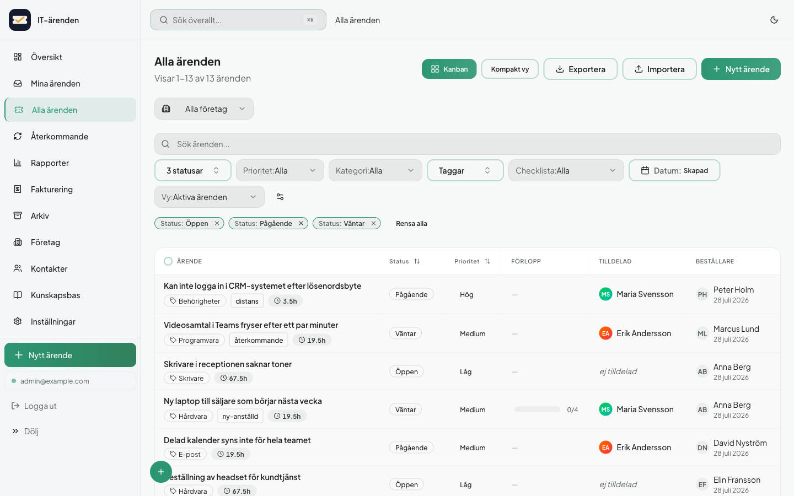
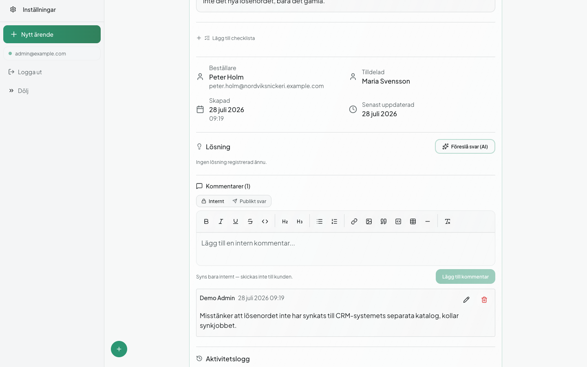

<!-- Decorative: the heading immediately below already carries the product name. -->


# IT-Ticket

**A self-hosted helpdesk for internal IT support at Prefabmästarna — tickets, a searchable knowledge base and mail-to-ticket in one small system, with no per-agent license fee.**

[](https://github.com/Antonk123/it-system/actions/workflows/ci.yml)
[](LICENSE)
[](.nvmrc)



> **Read this first:** the application UI is currently **Swedish only**. There is no i18n layer —
> interface strings are hardcoded and `index.html` ships `lang="sv"`. The code, API and
> documentation are English. If you need an English UI today, this is not ready for you yet;
> translating it is the most valuable contribution available right now.

---

## Why this instead of Jira / Freshdesk / Zendesk

IT-Ticket is built for one thing: an in-house IT team handling support requests from its own
colleagues. Those tools charge per agent per month, forever, for a workflow built around
software project management or enterprise support tiers an internal helpdesk does not need.
The concrete differences:

- **No per-user pricing.** MIT-licensed and self-hosted. Add ten technicians tomorrow and your
  bill does not change, because there is no bill.
- **Your data stays on your infrastructure.** A SQLite file on your disk, your backups, your
  retention policy. Nothing leaves the server unless you configure it to — SMTP, IMAP, outbound
  webhooks, or web push.
- **Built around the technician's loop**, not a project board: email-to-ticket and a searchable
  knowledge base linked directly from every ticket.
- **Deliberately small scope.** SLA tracking, invoicing and time registration were retired;
  historical data is preserved in the database but no longer exposed. The system does tickets,
  knowledge base, e-mail and the practical workflows around them (reminders, checklists,
  templates, reports).

**Where it is genuinely weaker.** Read this before you install it:

- **Swedish-only UI**, as above.
- **No multi-tenancy.** One deployment serves one organization. Isolating clients from each other
  means running separate instances — there is no tenant-scoping layer to audit or trust.
- **Not built for horizontal scaling.** SQLite is a single-writer store and rate limiting is
  in-memory per process. More than one backend replica behind a load balancer gives you
  inconsistent rate limiting and `SQLITE_BUSY` contention as soon as two writers collide.
- **No native mobile app.** It is an installable PWA, not an App Store listing.
- **No 2FA on password login.** OIDC SSO is an alternative login path, not a second factor
  layered on top of the password flow.
- **OIDC SSO never provisions accounts.** There is no JIT provisioning and no SCIM sync — an
  unknown identity is refused (`sso_error=unknown_user`), never created. Every account still has
  to be added by an admin first, SSO or not.
- **OIDC SSO is locked to exactly one tenant.** `OIDC_ISSUER_URL` must name a single tenant; the
  multi-tenant endpoints are rejected in code, not just documentation. Running SSO for more than
  one organization means more than one deployment, same as everything else in this list.
- **Young project, small community.** It runs in daily production use at one organization, but it
  has not had years of diverse deployments hammering on it. Read the code before you trust it
  with something critical — the same way you would with any young open-source tool.

## Features

**Ticketing** — full lifecycle with custom fields and templates, checklists, ticket linking,
personal reminders, bulk operations, CSV import and XLSX export, and public share links that
expire (30 days by default, 1–365 configurable).

**Knowledge base** — full-text search (SQLite FTS5) over a knowledge base linked directly from
ticket detail, with article types, drafts, staleness detection, cross-references, expiring
share links and an optional public portal.

**Communication** — email-to-ticket over IMAP (basic auth or Microsoft 365 OAuth2 client
credentials), outbound notification mail, and web push notifications.

**Access & integration** — multi-user accounts with roles, API keys with read/write scopes,
HMAC-signed outbound webhooks, and optional OIDC SSO (e.g. Microsoft Entra ID) alongside password
login.

**Operations** — automatic closing of idle tickets, scheduled backups with retention, an
optional off-site copy step and a list/download of stored backups in Settings, an audit log,
and seven UI themes.



## Quickstart

Requires Docker and Docker Compose v2. The installer targets **Debian/Ubuntu Linux** — it installs
missing prerequisites with `apt-get` and uses GNU `grep -P` and `hostname -I`. On macOS or another
distribution, use the manual steps below instead; the application itself runs anywhere Docker does.

```sh
bash <(curl -fsSL https://raw.githubusercontent.com/Antonk123/it-system/main/setup.sh)
```

The installer checks prerequisites, prompts for organization name, admin credentials and optional
API/SMTP settings, generates a `.env` with fresh secrets, builds the images and starts the stack.
It prints a URL and the admin login when it finishes. Its prompts are in Swedish, like the
application UI. Remove it again with [`uninstall.sh`](uninstall.sh).

Manual equivalent:

```sh
git clone https://github.com/Antonk123/it-system.git
cd it-system
cp .env.example .env      # set JWT_SECRET and CSRF_SECRET — openssl rand -base64 32

# The compose files reference prebuilt images and declare no build: section,
# so build them first.
docker build -f Dockerfile.server -t it-ticketing-backend:latest .
docker build -f Dockerfile.client -t it-ticketing-frontend:latest .
docker compose -f docker-compose.local.yml --env-file .env up -d

# Server startup only applies the schema and migrations — it creates no users,
# and there is no self-registration endpoint. Seed the first admin explicitly,
# or you will have a running system you cannot log in to.
docker exec -e ADMIN_EMAIL="you@example.com" \
            -e ADMIN_PASSWORD="a-strong-password" \
            -e ADMIN_NAME="Admin" \
            it-ticketing-backend node dist/db/init.js
```

Frontend on `:8082`; the API is published on `127.0.0.1:3002` only (loopback — the frontend's
nginx reaches the backend over the Docker network). The backend container runs as a non-root
user; a data volume created by an older (root) image must be `chown`ed once, see
[`docs/OPERATIONS.md`](docs/OPERATIONS.md). `ADMIN_EMAIL` and `ADMIN_PASSWORD` are both required
by `init.js`, and the password must satisfy the 12-character policy. Web push additionally needs
`VAPID_SUBJECT` (`mailto:` or `https:` contact) next to the VAPID keys.

## Architecture

Single-tenant by design: one Compose stack serves one organization. There is no tenant-routing
layer and no shared database between customers — isolation is "separate deployment", not
"separate row".

```
                    ┌──────────────────────────┐
                    │  React SPA (Vite)        │
                    │  served by nginx         │
                    └────────────┬─────────────┘
                                 │ JWT bearer + CSRF
                                 ▼
┌──────────────────────────────────────────────────────────────┐
│                   Express 5 API (Node 22)                    │
│  passport (JWT + local) · csrf-csrf · helmet                 │
│  24 route modules, 160 operations under /api/*               │
│                                                              │
│  background schedulers (node-cron):                          │
│   reminders · backups · auto-close · webhook retry ·         │
│   push aging · retention and token cleanup                   │
│                                                              │
│  IMAP poller (ImapFlow + @azure/msal-node) → mail-to-ticket  │
└───────────┬──────────────────────────────┬───────────────────┘
            ▼                              ▼
 ┌────────────────────────┐   ┌──────────────────────────────┐
 │ SQLite (better-sqlite3)│   │ Outbound webhooks            │
 │ WAL mode, single file  │   │ HMAC-SHA256 signed, persisted│
 │ 2 contentless FTS5     │   │ before delivery, retried with│
 │ tables (tickets, KB)   │   │ exponential backoff          │
 └────────────────────────┘   └──────────────────────────────┘
```

An interactive map of every module and endpoint is checked in:
[`docs/architecture-map.html`](docs/architecture-map.html) — open it in a browser.

## Security model

Full detail in [`SECURITY.md`](SECURITY.md). The short version, each row traced to the file that
implements it:

| Mechanism | Implementation | Where |
|---|---|---|
| Access tokens | JWT, HS256, 15-minute lifetime, verified by `passport-jwt` | `server/src/config/passport.ts` |
| Refresh | Rotating refresh tokens in an HttpOnly cookie (cookie only, never the body), stored as SHA-256 hashes; reusing a rotated token revokes the whole token family | `server/src/routes/auth.ts` |
| Passwords | Minimum 12 characters (3 of 4 character classes, or 16+), bcrypt cost 12 with rehash-on-login, per-IP and per-account login throttling; admin-created accounts must change the password on first login; a password change invalidates every other session | `server/src/lib/passwordPolicy.ts`, `server/src/routes/auth.ts` |
| API keys | `Bearer itk_live_…`, SHA-256 hashed at rest, constant-time compare; the raw key is never stored | `server/src/middleware/auth.ts` |
| API key scopes | `read` (default) / `write`. A key without `write` gets **403** on every mutating request — the key's scope is the credential, not the user's role | `server/src/middleware/auth.ts` |
| CSRF | Double-submit cookie; `x-csrf-token` required on cookie-authenticated mutations. Exempt: `/api/auth/login` (no session yet — authenticates from the body), `/api/public/*` and API-key requests (no cookie involved), and `/api/auth/refresh` and `/api/auth/logout`, which *do* read an ambient HttpOnly `SameSite=strict` cookie but are protected instead by single-use rotation with reuse detection (refresh) and by the fact that a forced logout only logs out (logout) | `server/src/app.ts` |
| Secrets fail closed | The backend exits with code 1 at boot if `JWT_SECRET` or `CSRF_SECRET` is missing — unconditionally, in every environment. Same exit if either is shorter than 32 characters, unless **both** `ALLOW_WEAK_SECRETS=1` **and** `NODE_ENV` is `development`/`test`, so a misconfigured production with `NODE_ENV` unset cannot silently fail open | `server/src/config/secretValidation.ts` |
| Webhooks | `X-Webhook-Signature` = hex HMAC-SHA256 over `timestamp.id.body` (with `X-Webhook-Timestamp` and `X-Webhook-Id` headers, so receivers can reject replays and duplicates); the delivery row is persisted *before* the first attempt so retries survive a crash; the target URL is re-resolved immediately before each request and redirects are never followed | `server/src/lib/webhookDispatcher.ts` |
| Uploads | MIME and extension allowlists plus a magic-byte check; **SVG is not accepted** as a ticket attachment, KB image or logo; downloads are always `Content-Disposition: attachment` | `server/src/routes/attachments.ts` |
| Public form | Rate limited (5/min/IP), hidden honeypot field and a minimum fill time | `server/src/routes/public.ts` |
| Headers | `helmet` with an explicit CSP (`default-src 'self'`, no inline scripts), HSTS with preload, `noSniff` | `server/src/app.ts` |

**Not solved:** rate limiting is in-memory and per-process; there is no 2FA on password login;
and there is no encryption at rest for the SQLite file, so confidentiality is delegated to
filesystem and host security. Public ticket share links always expire (30 days by default) and
can be revoked earlier by a user with write access to the ticket.

Found a vulnerability? **Do not open a public issue** — use the private
[security advisory form](https://github.com/Antonk123/it-system/security/advisories/new).

## Data & operations

**Storage.** SQLite via `better-sqlite3` in WAL mode with `foreign_keys=ON`. One writer at a
time, no separate database process to operate, and a backup is "copy a file" rather than
coordinating a dump against a running cluster. Full-text search uses two *contentless* FTS5
tables kept in sync by triggers, so ticket and article bodies are not stored on disk twice.

**Migrations.** Forward-only, no `down()`. Each migration is id-stamped in a `schema_migrations`
table so re-runs are idempotent, executes inside a transaction, and halts startup if it throws
rather than leaving the schema half-applied. Migrations run automatically on every server start —
there is no separate "remember to migrate" deploy step.

**Backup and restore are both exercised by tests, not merely documented.** Backups take a
WAL-safe online snapshot, run `PRAGMA integrity_check` before the snapshot enters rotation, zip
it together with uploads, and `chmod 0600` the archive because it contains the entire database.
Restore is protected against zip-slip and extraction-size caps, verifies the SQLite magic
header, runs `PRAGMA quick_check` and sanity-checks that the expected tables exist before
anything is swapped, and keeps `.pre-restore` copies of the database and uploads so a failed swap
rolls back. Stored backups can be listed and downloaded by an admin (`GET /api/backup/files`).

**Where data lives.** `data/database.sqlite` plus `data/uploads/` inside the backend container,
expected to sit on a persistent volume; `DB_PATH` and `UPLOAD_DIR` override the location.
Operational detail is in [`docs/OPERATIONS.md`](docs/OPERATIONS.md), upgrade and rollback steps in
[`docs/RUNBOOK.md`](docs/RUNBOOK.md).

## Quality gates

What CI runs on every push and pull request — four jobs, all required:

| Job | Runs | Fails on |
|---|---|---|
| `lint-and-typecheck` | ESLint with `--max-warnings 0`, `tsc --noEmit` against both frontend tsconfigs, the unused-code check, the frontend suite, `redocly lint docs/openapi.yaml`, and `scripts/check-openapi-coverage.mjs` (every mounted Express route must be in the spec) | any lint warning or type error, unused locals/parameters, any failing test, an invalid OpenAPI spec, or a route missing from it |
| `lint-server` | server typecheck, unused-code check, backend suite with coverage enforced | a failing test, or coverage dropping below the ratchet thresholds — which are raised as coverage improves and never lowered to make a build pass |
| `docker-build` | builds both production images (only after the two jobs above pass) | image build failure, catching Dockerfile drift a green test suite would not |
| `security-audit` | `scripts/audit-check.mjs` against both dependency trees | **any high or critical advisory**, unless listed in `audit-allowlist.json` with a written justification *and* an expiry date. That allowlist currently has **zero entries** — nothing is being suppressed |

**142 test files** (57 frontend, 85 backend; counted 2026-10-09 with
`find . -name '*.test.*' -not -path '*/node_modules/*'`). Every GitHub Actions step is pinned to a
commit SHA rather than a movable tag. Husky and lint-staged run the same ESLint rules before a
commit is allowed to land.

## Development setup

Node 22 (pinned in [`.nvmrc`](.nvmrc)) and **two independent `package.json` trees**, each with its
own lockfile and test suite: the repo root is the React/Vite frontend, `server/` is the Express
backend.

```sh
npm ci                        # frontend deps
cd server && npm ci && cd ..  # backend deps
```

| Where | Command | Does |
|---|---|---|
| root | `npm run dev` | Vite dev server |
| root | `npm test` | frontend suite |
| root | `npm run check:unused` | unused locals/parameters in the frontend |
| root | `npm run openapi:lint` | validate `docs/openapi.yaml` |
| root | `npm run lint` | ESLint over the whole repo |
| root | `npm run build` | production frontend build |
| `server/` | `npm run dev` | `tsx watch`, no build step |
| `server/` | `npm test` | backend suite |
| `server/` | `npm run check:unused` | unused locals/parameters in the backend |
| `server/` | `npm run build` | `tsc && cp` of `schema.sql` into `dist/` (fails the build if `tsc` fails) |

## Configuration

Everything is environment variables — see [`.env.example`](.env.example) for the full commented
list. What actually gates startup:

| Variable | Required | If missing or weak |
|---|---|---|
| `JWT_SECRET` | yes | process exits with code 1 at boot; same if under 32 characters |
| `CSRF_SECRET` | yes | same fail-closed behavior |
| `CORS_ORIGIN` | in production | no browser origin is allowlisted and the SPA cannot call the API |
| `APP_BASE_URL` | recommended | not fail-closed: the server logs a warning and falls back to the first origin in `CORS_ORIGIN`. With neither set, links in outgoing email (password reset, ticket links) are unusable |
| `SMTP_*` / `IMAP_*` | no | outbound mail and mail-to-ticket, independently optional |
| `VAPID_*` | no | web push; generated by the setup script. `VAPID_SUBJECT` (`mailto:…` or `https://…`) is required whenever push is enabled, otherwise push stays disabled with a warning |
| `ADMIN_EMAIL` / `ADMIN_PASSWORD` | when seeding the first admin | `db/init.ts` exits with code 1 if either is missing or the password breaks the 12-character policy |
| `OIDC_*` | no | SSO stays off until all four values are set. Two rules are enforced in code, not left to configuration: `OIDC_ISSUER_URL` must name exactly one tenant — all three multi-tenant path segments (`/common`, `/organizations`, `/consumers`) are rejected identically on the configured URL's path segment, but for different reasons: `/common` and `/organizations` discover a placeholder issuer (`{tenantid}`) that would make the `iss` check self-referential and let any Entra tenant validate, while `/consumers` discovers a *concrete* issuer for Microsoft's own personal-account tenant, so it's rejected separately, both on that segment name and again on the discovered tenant GUID — and SSO only authenticates accounts that already exist, so an unknown identity is refused instead of provisioned |

## API

Machine-readable contract: [`docs/openapi.yaml`](docs/openapi.yaml) (OpenAPI 3.0, validated in
CI). Rendered reference: [`docs/api.html`](docs/api.html). Prose reference with auth chains and
rate limits per route: [`docs/API.md`](docs/API.md).

Everything is mounted under `/api` (160 operations). Authentication is a JWT bearer token **or** an
API key; mutating requests additionally require the `x-csrf-token` header unless authenticated by
API key. Ticket access is one rule: every signed-in user can read; writing needs admin, the
assignee or creator, or an unassigned ticket
([ADR 0001](docs/adr/0001-unified-ticket-access-policy.md)).

**Outgoing webhooks — breaking change.** `X-Webhook-Signature` is now
`hex(HMAC-SHA256(secret, timestamp + "." + id + "." + rawBody))` with the `X-Webhook-Timestamp`
and `X-Webhook-Id` headers; the old body-only signature no longer verifies. Receivers must verify
over the raw bytes, compare in constant time, reject timestamps older than ~5 minutes and dedupe
on the id. Details in [`docs/API.md`](docs/API.md#webhooks--apiwebhooks).

## Behaviour changes to expect after upgrading

- **Everyone logs in once more.** Refresh tokens are now stored hashed and old ones are wiped,
  so every session ends at deploy.
- **Admin-created accounts must change their password** on first login; passwords need at
  least 12 characters (3 of 4 character classes, or 16+).
- **Webhook receivers must be updated** (signature above).
- **SVG is no longer accepted** as a ticket attachment, KB image or logo.
- **The public ticket form has a honeypot** and a minimum fill time; bots get a fake success.
- **Stored backup files** can be listed and downloaded by admins in Settings.
- **Ticket permissions are uniform** — see the API section.
- Operators: the backend port is bound to loopback, containers run as non-root (existing data
  volumes need a one-time `chown`), and the Portainer stack is a separate copy of the compose
  file that must be updated by hand. Full list in [`CHANGELOG.md`](CHANGELOG.md).

## Contributing

Setup, quality bar and PR process: [`CONTRIBUTING.md`](CONTRIBUTING.md). Your branch clears the
same lint, typecheck, test and audit gates CI runs — there is no looser bar for external
contributions.

## Project status

IT-Ticket is focused on daily internal IT support at one organization.
Core ticketing and email features are
solid and covered by the test suite; expect rougher edges than a project with years of external
users behind it. Issues and pull requests are welcome.

## License

[MIT](LICENSE)
